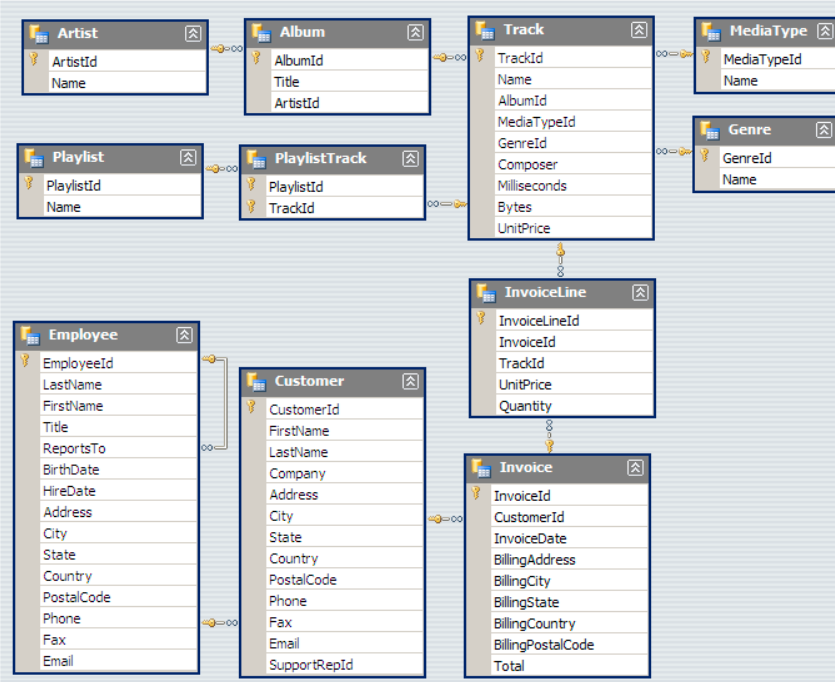
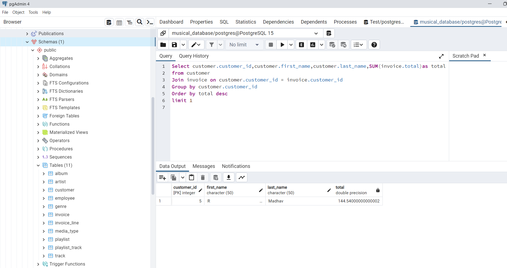
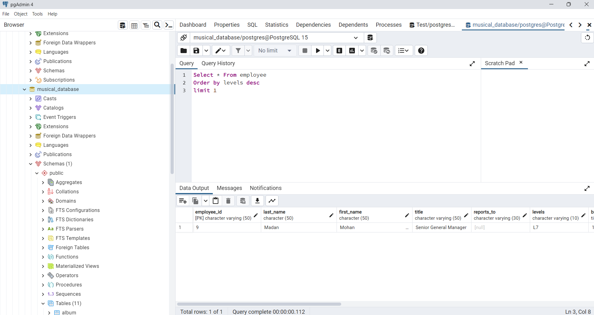
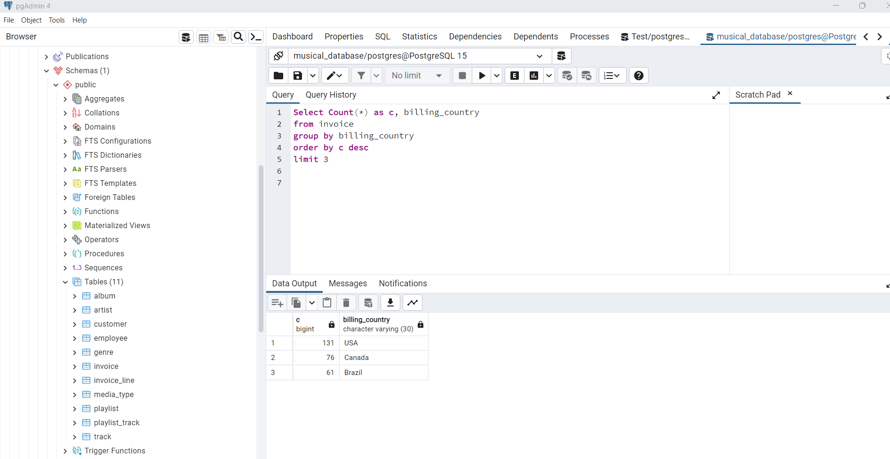

This is project called " MUsical Database Schema" which has been created using PostgreSQL and pgAdmin4
All the tables have been related to each other by the schema  as shown below. We can use the schema and SQL queries to find out various parameters like which customer has spent the most, 3 most profitable queries, etc

## Requirements
* PostgreSQL
* pgAdmin4
